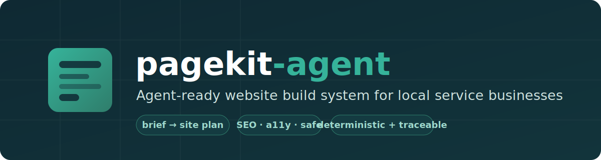
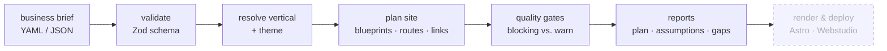

<p align="center">
  
</p>

<h1 align="center">pagekit-agent</h1>

<p align="center">
  <strong>Generate complete, SEO-ready, accessible websites for local service businesses — from a structured brief, by an LLM agent, with full traceability.</strong>
</p>

<p align="center">
  <a href="https://github.com/sydneyvb-nl/pagekit-agent/actions/workflows/validate.yml"></a>
  <a href="./LICENSE"></a>
  = 22">
  
  
  <a href="CONTRIBUTING.md"></a>
</p>

<p align="center">
  <a href="#quickstart">Quickstart</a> ·
  <a href="#how-it-works">How it works</a> ·
  <a href="#why-its-different">Why it's different</a> ·
  <a href="docs/README.md">Docs</a> ·
  <a href="docs/roadmap.md">Roadmap</a>
</p>

---

> **Not** a generic UI kit or a "prompt → landing page" toy. pagekit-agent is a
> deterministic site **production system** whose primary user is an LLM agent:
> explicit rules, predictable files, validation gates, and full traceability from
> brief field → rule → generated page.

## What it does

You hand an agent a short business brief:

```yaml
business:
  name: "Verloskundigenpraktijk Example"
  type: "midwifery_practice"
  city: "Den Haag"
  language: "nl"
  services: ["Zwangerschapscontroles", "Echo's", "Kraamzorg"]
  # ...
```

…and it produces a full, structured website — homepage, service pages,
about/team/location/contact, FAQ, legal pages, sitemap, structured data, SEO
metadata — **plus reports that explain every decision and every gap.**

## How it works



Every run writes a **“no silent magic”** report set so nothing is hidden:

| File | What it answers |
| ---- | --------------- |
| `site-plan.md` | Which pages, routes, sections, schema, and internal links exist — and why |
| `site-map.yaml` | The machine-readable route map |
| `assumptions.md` | Every safe assumption the agent made |
| `missing-inputs.md` | Every gap left as an explicit `TODO` (never invented) |

## Why it's different

- 🤖 **Agent-first.** [`AGENTS.md`](AGENTS.md) is the entrypoint and routes the
  agent through the docs. Instructions are executable (`hero.local-service` +
  spacing token), not vibes ("make it modern").
- 🧱 **Deterministic structure, constrained copy.** Routes, sections, schema
  types and validation are fixed; headings and body copy are creative *within*
  rules. The same brief always plans the same site.
- 🔍 **No silent magic.** Every decision and gap is written to a report.
- 🛡️ **Safe by default.** Never invents credentials, testimonials, prices,
  opening hours, or medical/legal claims — gaps become `TODO`s.
- 🧩 **Extensible by config.** Add a whole business vertical by dropping in a YAML
  file, not by rewriting the generator.

## Quickstart

Requires **Node ≥ 22** (Node 24 LTS recommended) and **pnpm ≥ 11**
(`corepack enable` provides it).

```bash
pnpm install
pnpm validate:brief     # validate the example brief
pnpm plan               # plan the site, write reports to generated/
pnpm test               # run the test suite
```

Use your own brief:

```bash
cp input/business-brief.example.yaml input/business-brief.yaml
# edit it, then:
pnpm validate:brief input/business-brief.yaml
pnpm plan input/business-brief.yaml
```

Inspect a vertical:

```bash
pnpm inspect:vertical midwifery_practice
```

<details>
<summary><strong>Example output</strong> — planning the midwifery brief (13 pages)</summary>

```text
✓ Brief is valid: input/business-brief.example.yaml
  business: Verloskundigenpraktijk Example (midwifery_practice)
⚠ [warning] Regulated EU context with a form provider: contact form must include consent.
✓ Wrote 4 report(s) to generated/
  - site-plan.md
  - site-map.yaml
  - assumptions.md      → "No logo provided; header uses a text wordmark."
  - missing-inputs.md   → "business.contact.address — left as TODO."
✓ Plan passes structural quality gates (13 pages).
```

See the committed run in
[`examples/generated-sites/midwifery-den-haag/`](examples/generated-sites/midwifery-den-haag/).

</details>

## Repository layout

```
AGENTS.md                  # primary agent entrypoint — read this first
input/                     # business-brief schema (JSON + Zod) and example
packages/generator/        # TypeScript generator: brief → plan → reports
verticals/                 # per-vertical config (pages, schema, cautions)
design/                    # design tokens + theme presets
sections/                  # reusable section definitions
content-rules/             # content safety + tone rules
skills/                    # task recipes the agent can follow
docs/                      # human + machine documentation
examples/                  # example briefs and generated output
```

## Status

**v0.1 — foundation.** Implemented today: brief validation, vertical resolution,
deterministic site planning, internal-link graph, structural quality gates, and
the report set. Not yet built: Astro rendering, SEO/schema emission,
accessibility runners, Webstudio handoff, full example sites.

See [`docs/status.md`](docs/status.md) for the authoritative built-vs-planned
list and [`docs/roadmap.md`](docs/roadmap.md) for the phased plan.

## Documentation

[`docs/README.md`](docs/README.md) is the documentation map. **If you're an LLM
agent, start at [`AGENTS.md`](AGENTS.md)** — it routes you through the docs in the
order you need them. Core reading: working
[principles](docs/principles.md) · [architecture](docs/architecture.md) ·
[generation protocol](docs/site-generation-protocol.md) ·
[quality gates](docs/quality-gates.md).

## Foundation & licensing

The static-site output target is [Astro](https://astro.build); the visual-builder
handoff target is [Webstudio](https://webstudio.is). pagekit-agent is an
**independent generator and mapping layer** — it does not bundle or modify
Webstudio source. Webstudio itself is AGPL-3.0-or-later; if you self-host or
integrate it, comply with its license separately.

This repository is licensed under **Apache-2.0** — see [`LICENSE`](./LICENSE) and
[`NOTICE`](./NOTICE).

## Contributing

Contributions welcome — see [`CONTRIBUTING.md`](CONTRIBUTING.md). The fastest way
to extend the system is to add a vertical
([`docs/vertical-authoring.md`](docs/vertical-authoring.md)).
